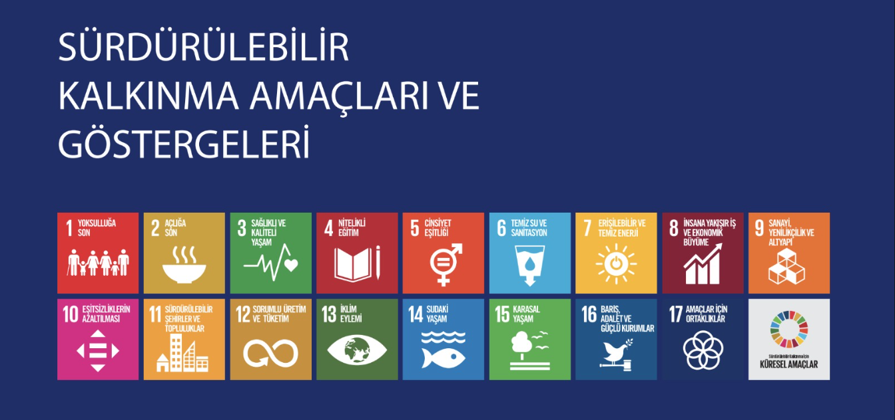

# SÜRDÜRÜLEBİLİR KALKINMA AMAÇLARI

## 1. YOKSULLUĞA SON
Yoksulluğun tüm biçimlerini her yerde sona erdirmek.

## 2. AÇLIĞA SON
Açlığı bitirmek, gıda güvenliğine ve iyi beslenmeye ulaşmak ve sürdürülebilir tarımı desteklemek.

## 3. SAĞLIK VE KALİTELİ YAŞAM
Sağlıklı ve kaliteli yaşamı her yaşta güvence altına almak.

## 4. NİTELİKLİ EĞİTİM
Kapsayıcı ve hakkaniyete dayanan nitelikli eğitimi sağlamak ve herkes için yaşam boyu öğrenim fırsatlarını teşvik etmek.

## 5. TOPLUMSAL CİNSİYET EŞİTLİĞİ
Cinsiyet eşitliğini sağlamak ve tüm kadınlar ile kız çocuklarını güçlendirmek.

## 6. TEMİZ SU VE SANİTASYON
Herkes için erişilebilir su ve atıksu hizmetlerini ve sürdürülebilir su yönetimini güvence altına almak.

## 7. ERİŞİLEBİLİR VE TEMİZ ENERJİ
Herkes için karşılanabilir, güvenilir, sürdürülebilir ve modern enerjiye erişimi sağlamak.

## 8. İNSANA YAKIŞIR İŞ VE EKONOMİK BÜYÜME
İstikrarlı, kapsayıcı ve sürdürülebilir ekonomik büyümeyi, tam ve üretken istihdamı ve herkes için insana yakışır işleri desteklemek.

## 9. SANAYİ, YENİLİKÇİLİK VE ALTYAPI
Dayanıklı altyapılar tesis etmek, kapsayıcı ve sürdürülebilir sanayileşmeyi desteklemek ve yenilikçiliği güçlendirmek.

## 10. EŞİTSİZLİKLERİN AZALTILMASI
Ülkelerin içinde ve arasındaki eşitsizlikleri azaltmak.

## 11. SÜRDÜRÜLEBİLİR ŞEHİRLER VE TOPLULUKLAR
Şehirleri ve insan yerleşimlerini kapsayıcı, güvenli, dayanıklı ve sürdürülebilir kılmak.

## 12. SORUMLU ÜRETİM VE TÜKETİM
Sürdürülebilir üretim ve tüketim kalıplarını sağlamak.

## 13. İKLİM EYLEMİ
İklim değişikliği ve etkileri ile mücadele için acilen eyleme geçmek.

## 14. SUDAKİ YAŞAM
Sürdürülebilir kalkınma için okyanusları, denizleri ve deniz kaynaklarını korumak ve sürdürülebilir kullanmak.

## 15. KARASAL YAŞAM
Karasal ekosistemleri korumak, iyileştirmek ve sürdürülebilir kullanımını desteklemek; sürdürülebilir orman yönetimini sağlamak; çölleşme ile mücadele etmek; arazi bozunumunu durdurmak ve tersine çevirmek; biyolojik çeşitlilik kaybını engellemek.

## 16. BARIŞ, ADALET VE GÜÇLÜ KURUMLAR
Sürdürülebilir kalkınma için barışçıl ve kapsayıcı toplumlar tesis etmek, herkes için adalete erişimi sağlamak ve her düzeyde etkili, hesap verebilir ve kapsayıcı kurumlar oluşturmak.

## 17. AMAÇLAR İÇİN ORTAKLIKLAR
Uygulama araçlarını güçlendirmek ve sürdürülebilir kalkınma için küresel ortaklığı canlandırmak.

## REFERANSLAR 
[Birleşmiş Milletler Sürdürülebilir Kalkınma Amaçları](http://www.surdurulebilirkalkinma.gov.tr/wp-content/uploads/2021/02/SKA-ve-Gostergeleri-Kapak-Birlestirilmis.pdf)
[T.C. Cumhurbaşkanlığı Sürdürülebilir Kalkınma Dökümalnarı](https://sdgs.un.org/#goal_section)
